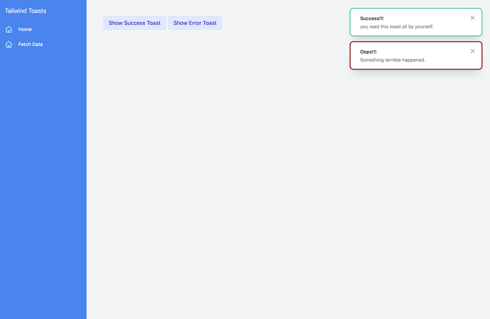

# TailBlazor.Toast

Blazor toast notifications shell using Tailwindcss v2.0+

Thank you to Chris Sanity for the base functionality through Blazored.Toasts. This is basically a fork of his work.

This version uses Tailwindcss instead of bootstrap. There are a few base styles included, however, With TailBlazor being so incredibly low level there is the option to load entire render fragments in instead to give unlimited customization to toasts

You can pass it a component through a renderfragment giving you unlimited customization and the ability to have highly interactive notifications.




## Getting Setup

You can install the package via the NuGet package manager just search for TailBlazor.Toast. You can also install via powershell using the following command.
This package now requires TailBlazor.HeroIcons

`Install-Package TailBlazor.Toast`
`Install-Package TailBlazor.HeroIcons`

Or via the dotnet CLI.

`dotnet add package TailBlazor.Toast`
`dotnet add package TailBlazor.HeroIcons`

### 1. Register Services

register toast service

Blazor Server

Add to Startup.ConfigureServices method in Startup.cs

`services.AddTailBlazorToast();`

### 2. Add Imports

Add lines to your \_Imports.razor

```
@using TailBlazor.Toast.Services 
@using TailBlazor.Toast
```

### 3. Register and Configure Toasts Component

Add this to the top of your MainLayout.razor component.

`<TailBlazorToasts />`

### 4. Using basic components

Edit the TailBlazorToasts component in mainlayout with your base settings

```
<TailBlazorToasts 
    Timeout="10" 
    Position="ToastPosition.TopRight"
    IconStyle="HeroIcons.IconStyle.Outline"
    SuccessIcon="HeroIcon.Check"  />
```


```
<button type="button" @onclick="@(() => toastService.ShowSuccess("Success","I'm a heading"))"
        class="inline-flex items-center px-4 py-2 text-base font-medium text-indigo-700 bg-indigo-100 border border-transparent rounded-md hover:bg-indigo-200 focus:outline-none focus:ring-2 focus:ring-offset-2 focus:ring-indigo-500">
    Show Success Toast
</button>

<button type="button" @onclick="@(() => toastService.ShowError("Uh Oh","I'm a heading"))"
        class="inline-flex items-center px-4 py-2 text-base font-medium text-indigo-700 bg-indigo-100 border border-transparent rounded-md hover:bg-indigo-200 focus:outline-none focus:ring-2 focus:ring-offset-2 focus:ring-indigo-500">
    Show Error Toast
</button>

```


#### 5. Create your custom toast component

You can create the template that you'll use for some or all of your toasts using tailwind.

Here is a basic example. Create a folder named `Toasts` and create a component called `SimpleToast.razor` and add the following code.

```
<div class="pointer-events-auto p-4 mb-5 bg-white shadow-xl ring ring-blue-500 rounded-lg">
    <div class="flex items-start">
        <div class="flex-shrink-0">
            <svg xmlns="http://www.w3.org/2000/svg" fill="none" viewBox="0 0 24 24" stroke="currentColor">
                <path stroke-linecap="round" aria-hidden="true" stroke-linejoin="round" stroke-width="2"
                    d="M9 12l2 2 4-4M7.835 4.697a3.42 3.42 0 001.946-.806 3.42 3.42 0 014.438 0 3.42 3.42 0 001.946.806 3.42 3.42 0 013.138 3.138 3.42 3.42 0 00.806 1.946 3.42 3.42 0 010 4.438 3.42 3.42 0 00-.806 1.946 3.42 3.42 0 01-3.138 3.138 3.42 3.42 0 00-1.946.806 3.42 3.42 0 01-4.438 0 3.42 3.42 0 00-1.946-.806 3.42 3.42 0 01-3.138-3.138 3.42 3.42 0 00-.806-1.946 3.42 3.42 0 010-4.438 3.42 3.42 0 00.806-1.946 3.42 3.42 0 013.138-3.138z" />
            </svg>
        </div>
        <div class="ml-3 w-0 flex-1 pt-0.5">
            <p class="text-sm font-medium text-gray-900">Info!</p>
            <p class="mt-1 text-sm text-gray-500">Nothing to worry about, everything is working great</p>
        </div>
        <div class="flex flex-shrink-0 ml-4">
            <button
                class="inline-flex text-gray-400 bg-white rounded-md hover:text-gray-500">
                <span class="sr-only">Close</span>
                <svg class="w-5 h-5" xmlns="http://www.w3.org/2000/svg" viewBox="0 0 20 20" fill="currentColor"
                    aria-hidden="true">
                    <path fill-rule="evenodd"
                        d="M4.293 4.293a1 1 0 011.414 0L10 8.586l4.293-4.293a1 1 0 111.414 1.414L11.414 10l4.293 4.293a1 1 0 01-1.414 1.414L10 11.414l-4.293 4.293a1 1 0 01-1.414-1.414L8.586 10 4.293 5.707a1 1 0 010-1.414z"
                        clip-rule="evenodd" />
                </svg>
            </button>
        </div>
    </div>
</div>
```

#### 5. Use your toast component

Go to Index and inject your toast service

`@inject IToastService toastService`

then add a button to trigger your toast

```
<button type="button" @onclick="@ShowToast" class=" px-6 py-2 text-base font-bold text-indigo-700 bg-indigo-100 rounded-lg hover:bg-indigo-200 ">Show Toast</button>
```

finally create the ShowToast method to activate your toast.

```
private void ShowSuccess()
{
    RenderFragment toast = @<SimpleToast />;
    toastService.ShowToast(toast);
}
```
